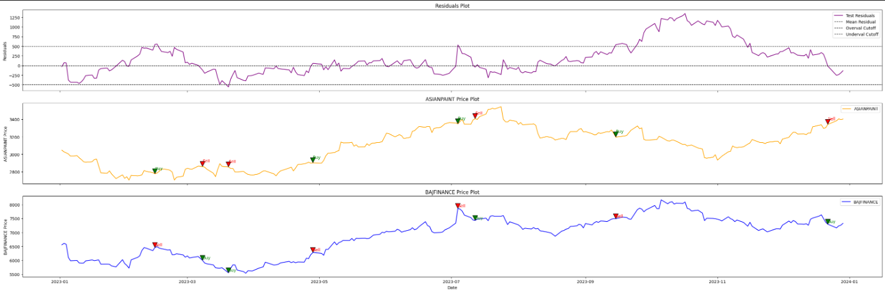
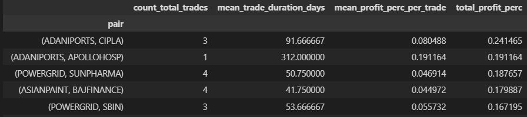

# Statistical Arbitrage: Pairs Trading 

This project aims to perform statistical arbitrage backtesting on select stock pairs from the NIFTY 50 index.

## What is Statistical Arbitrage?

Statistical arbitrage, particularly in the context of pairs trading, exploits the cointegration between two stocks. It takes advantage of the inherent stationarity of cointegrated pairs by generating trading signals when their prices deviate from their historical relationship.

## How is Cointegration Detected?

There are several tests to detect cointegration, but this project utilizes the **Augmented Dickey-Fuller (ADF)** test to identify cointegration between stock pairs.

## Approach

- We analyze stocks from the **NIFTY 50** index over the years **2017 to 2022**.
- Relationships between constituent stocks are observed, and pairs that pass the ADF test are shortlisted.
- The shortlisted pairs are backtested using data from the year **2023** to evaluate the strategy’s performance.
- **Example**: Below is a screenshot from the backtesting process for the **ASIANPAINTS** and **BAJFINANCE** pair:

## Results

The following pairs were found to be cointegrated at a **99% confidence level**:

| **Column 1**                   | **Column 2**                   | **Column 3**                   |
|---------------------------------|---------------------------------|---------------------------------|
| (ADANIPORTS, APOLLOHOSP)        | (APOLLOHOSP, ASIANPAINT)        | (ASIANPAINT, HDFCBANK)          |
| (ADANIPORTS, BAJAJ-AUTO)        | (APOLLOHOSP, BAJAJFINSV)        | (ASIANPAINT, INFY)              |
| (ADANIPORTS, CIPLA)             | (APOLLOHOSP, HCLTECH)           | (ASIANPAINT, KOTAKBANK)         |
| (ADANIPORTS, JSWSTEEL)          | (APOLLOHOSP, HDFCBANK)          | (ASIANPAINT, TCS)               |
| (ADANIPORTS, ULTRACEMCO)        | (APOLLOHOSP, INFY)              | (ASIANPAINT, TATACONSUM)        |
| (APOLLOHOSP, TITAN)             | (APOLLOHOSP, ULTRACEMCO)        | (BAJFINANCE, HCLTECH)           |
| (ASIANPAINT, BAJFINANCE)        | (BAJFINANCE, INFY)              | (BAJFINANCE, KOTAKBANK)         |
| (EICHERMOT, MARUTI)             | (GRASIM, HINDALCO)              | (GRASIM, POWERGRID)             |
| (GRASIM, TATAMOTORS)            | (HCLTECH, HDFCBANK)             | (HCLTECH, INFY)                 |
| (HCLTECH, ULTRACEMCO)           | (HDFCBANK, KOTAKBANK)           | (HDFCBANK, TCS)                 |
| (HINDALCO, POWERGRID)           | (HINDALCO, TATASTEEL)           | (HINDUNILVR, KOTAKBANK)         |
| (HINDUNILVR, NESTLEIND)         | (ICICIBANK, TITAN)              | (ICICIBANK, TRENT)              |
| (INFY, TCS)                     | (INFY, ULTRACEMCO)              | (KOTAKBANK, TCS)                |
| (POWERGRID, SBIN)               | (POWERGRID, SUNPHARMA)          |                                 |

---

## Top-Performing Pairs 2023

Here is the screenshot showing the details of the top-performing pairs based on trade counts and performance metrics:

## Main Notebooks

### `data_procurement.ipynb`
Extracts stock data from **Yahoo Finance**, cleans it, and stores the processed data in the `data` folder.

### `main.ipynb`
The main notebook that shortlists cointegrated stocks and performs the backtesting process.

## Helper Files

### `pairsbacktester.py`
Contains the backtesting class used to evaluate trades on a pair of stocks.

### `utils.py`
Includes various helper functions used throughout the project.
