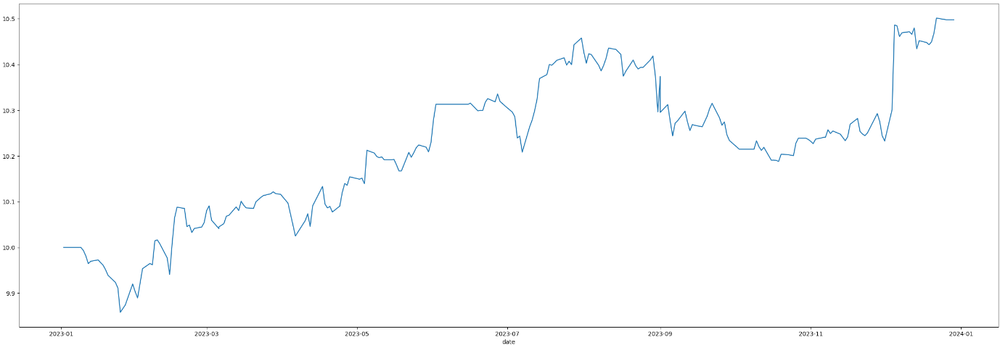

# Statistical Arbitrage: Pairs Trading 

The goal of this project is to backtest (trading) cointegrated pairs from the NIFTY 50 index and observe the results of this strategy in the year 2023. The reason why I'm only backtesting for a single year is because my stock selection criteria (selecting the NIFTY 50 index) can cause survivorship bias and I need the rolling index constituents for each year to accurately backtest. As that information isn't publicly available (although I'm working on something to get my hands on such a resource), I have pivoted to only performing a simple backtest using statistics and a naive but effective backesting engine.

## What is Statistical Arbitrage?

Statistical arbitrage, particularly in the context of pairs trading, exploits the cointegration between two stocks. It takes advantage of the inherent stationarity of cointegrated pairs by generating trading signals when their prices deviate from their historical relationship.

## How is Cointegration Detected?

I utilize the **Augmented Dickey-Fuller (ADF)** test to test the null hypothesis (99% confidence interval) that the residuals between the stock pairs have a unit root against the alternative hypothesis that their residuals have a stationary root.

## Approach

- Retrieve closing prices of **NIFTY 50 (2024)** stocks for the years **2017 to 2022** (```data_procurement.ipynb```) and save in a file ```data/closing_prices.csv```
- Analyze stocks, find a list of cointegrated pairs and prepare residual data for backtesting (```finding_cointegrated_pairs.ipynb```)
  - Split data into training _(2017 to 2022)_ and testing _(2023)_
  - For each pair combination _(50 * 49 = 2450)_, regress the pairs against each other and test their residuals for stationarity
  - If the pairs have a stationary root, save the model into a dictionary (```COINTEGRATED_PAIR_MODELS```)
  - Arbitrarily shortlist 10 pairs save their residuals in a data frame in ```data/backtesting_data.csv```
- Backtest using testing data from the year **2023** to evaluate the portfolio’s performance. (```backtesting.ipynb```)
  - **Portfolio starting capital**: _10_
  - **Strategy**: Invest _2 units (20% of initial portoflio capital)_ in a pair strategy if the pair's residual breaches the _Z-score of 1_
    - **Target**: Either _+10%_ profit or residual returns to its mean _(Z-score 0)_
    - **Stoploss**: Either _-10%_ loss or residual crosses a _Z-score of 2_

## Results
The portfolio of the 10 arbitrarily chosen pairs obtained a return of **4.97%** for the year 2023 with a max drawdown of **2.57%** (results in ```backtesting.ipynb```) and the following trade statistics were obeserved:
- _Trade Win Percentage: **63%**_
- _Trade Sharpe: **0.2**_
- _Trade Sortino: **0.42**_
- _Average Trade Duration: **16 days**_
### Portfolio Equity Curve


### Portfolio Drawdown Curve


## Future Improvements

- Ranking metric to shortlist the top pairs.
- Long-short ticker weights proportional to regression coefficients.
- Implement backtesting for a longer time period.
- Structural change detection.

